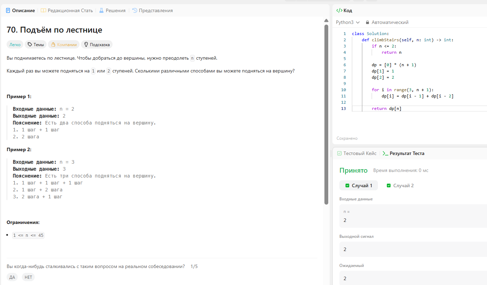

# Решенная практика

## Climbing Stairs


## Sort Colors

``` python
class Solution:
    def sortColors(self, nums: List[int]) -> None:
        n = len(nums)
        
        for i in range(n):
            for j in range(0, n - i - 1):
                if nums[j] > nums[j + 1]:
                    nums[j], nums[j + 1] = nums[j + 1], nums[j]
        
        return nums
```

## CountingSort1

``` python
#!/bin/python3

import math
import os
import random
import re
import sys

#
# Complete the 'countingSort' function below.
#
# The function is expected to return an INTEGER_ARRAY.
# The function accepts INTEGER_ARRAY arr as parameter.
#

def countingSort(arr):   
    if not arr:
        return [] 
        
    count = [0] * 100
    
    for num in arr:
        count[num] += 1
    
    return count
    

if __name__ == '__main__':
    fptr = open(os.environ['OUTPUT_PATH'], 'w')

    n = int(input().strip())

    arr = list(map(int, input().rstrip().split()))

    result = countingSort(arr)

    fptr.write(' '.join(map(str, result)))
    fptr.write('\n')

    fptr.close()
```

## CountingSort2

``` python
#!/bin/python3

import math
import os
import random
import re
import sys

#
# Complete the 'countingSort' function below.
#
# The function is expected to return an INTEGER_ARRAY.
# The function accepts INTEGER_ARRAY arr as parameter.
#

def countingSort(arr):
    if not arr:
        return []
    
    min_val = min(arr)
    max_val = max(arr)
    
    count = [0] * (max_val - min_val + 1)
    
    for num in arr:
        count[num - min_val] += 1
    
    result = []
    for i, cnt in enumerate(count):
        result.extend([i + min_val] * cnt)
    
    return result

if __name__ == '__main__':
    fptr = open(os.environ['OUTPUT_PATH'], 'w')

    n = int(input().strip())

    arr = list(map(int, input().rstrip().split()))

    result = countingSort(arr)

    fptr.write(' '.join(map(str, result)))
    fptr.write('\n')

    fptr.close()
```

## CountingSort3

``` python
# Enter your code here. Read input from STDIN. Print output to STDOUT
def counting_sort_cumulative(arr):
    count = [0] * 100
    
    for num, string in arr:
        if 0 <= num < 100:
            count[num] += 1
    
    cumulative = [0] * 100
    cumulative[0] = count[0]
    
    for i in range(1, 100):
        cumulative[i] = cumulative[i-1] + count[i]
    
    return cumulative

if __name__ == '__main__':
    import sys
    
    data = sys.stdin.read().splitlines()
    n = int(data[0])
    
    arr = []
    for i in range(1, n + 1):
        parts = data[i].split()
        num = int(parts[0])
        string = parts[1] if len(parts) > 1 else ""
        arr.append((num, string))
    
    result = counting_sort_cumulative(arr)

    print(' '.join(map(str, result)))
```

## QuickSort1

``` python
#!/bin/python3

import math
import os
import random
import re
import sys

#
# Complete the 'quickSort' function below.
#
# The function is expected to return an INTEGER_ARRAY.
# The function accepts INTEGER_ARRAY arr as parameter.
#

def quickSort(arr):
    
    def _quick_sort(lst, low, high):
        if low < high:
            pi = _partition(lst, low, high)
            _quick_sort(lst, low, pi - 1)
            _quick_sort(lst, pi + 1, high)
    
    def _partition(lst, low, high):
        pivot = lst[high]
        i = low - 1
        for j in range(low, high):
            if lst[j] <= pivot:
                i += 1
                lst[i], lst[j] = lst[j], lst[i]
        lst[i + 1], lst[high] = lst[high], lst[i + 1]
        return i + 1
    
    _quick_sort(arr, 0, len(arr) - 1)
    return arr

if __name__ == '__main__':
    fptr = open(os.environ['OUTPUT_PATH'], 'w')

    n = int(input().strip())

    arr = list(map(int, input().rstrip().split()))

    result = quickSort(arr)

    fptr.write(' '.join(map(str, result)))
    fptr.write('\n')

    fptr.close()
```

## Top K-frequent elements

``` python
class Solution:
    def topKFrequent(self, nums: List[int], k: int) -> List[int]:
            mn = abs(min(nums))
            nums = [i + mn for i in nums]
            a = [[0, i] for i in range(0, max(nums) + 1)]
            for i in nums:
                a[i][0] += 1
            a.sort()
            ans = []
            for i in range(1, k + 1):
                ans.append(a[-i])
            ans = [i[1] - mn for i in ans]
            ans = ans[::-1]
            return ans
```

## Kth largest element

``` python
def merge(L, R):
        ans = []
        ptr_1 = 0
        ptr_2 = 0
        while not (ptr_1 == len(L) and ptr_2 == len(R)):
            if ptr_1 == len(L):
                ans.append(R[ptr_2])
                ptr_2 += 1
            elif ptr_2 == len(R):
                ans.append(L[ptr_1])
                ptr_1 += 1
            elif L[ptr_1] <= R[ptr_2]:
                ans.append(L[ptr_1])
                ptr_1 += 1
            else:
                ans.append(R[ptr_2])
                ptr_2 += 1
        return ans

def merge_sort(nums):
    if len(nums) <= 1:
        return nums
    mid = len(nums)//2
    return merge(merge_sort(nums[:mid]), merge_sort(nums[mid:]))

class Solution:
    def findKthLargest(self, nums: List[int], k: int) -> int:
        ans = merge_sort(nums)
        return ans[-k]
```

## Parenteses

``` python
class Stack:
    def __init__(self):
        self.items = []
        self.min_stack = []
    
    def push(self, x: int) -> None:
        self.items.append(x)
    
    def pop(self) -> int:
        value = self.items.pop()
    
    def peek(self) -> int:
        return self.items[-1]
    
    def size(self) -> int:
        return len(self.items)


class Solution:
    def isValid(self, s: str) -> bool:
        stack = Stack()
        for i in s:
            if i in ['(', '{', '[']:
                stack.push(i)
            else:
                if stack.size() == 0:
                    return False
                else:
                    if i == ']':
                        if stack.peek() == '[':
                            stack.pop()
                        else:
                            return False
                    elif i == ')':
                        if stack.peek() == '(':
                            stack.pop()
                        else:
                            return False
                    else:
                        if stack.peek() == '{':
                            stack.pop()
                        else:
                            return False
        if stack.size() != 0:
            return False

        return True
```

## Stack using Queue

``` python
class MyStack:

    def __init__(self):
        self.q = deque()

    def push(self, x: int) -> None:
        self.q.append(x)
        for i in range(len(self.q) - 1):
            self.q.append(self.q.popleft())

    def pop(self) -> int:
        return self.q.popleft()
        
    def top(self) -> int:
        return self.q[0]

    def empty(self) -> bool:
        return len(self.q) == 0

```

## Queue using Stack

``` python
class MyQueue:

    def __init__(self):
        self.s = []

    def push(self, x: int) -> None:
        self.s.append(x)
        self.s = self.s[::-1]

    def pop(self) -> int:
        return self.s.pop()

    def peek(self) -> int:
        return self.s[-1]

    def empty(self) -> bool:
        return len(self.s) == 0
```
